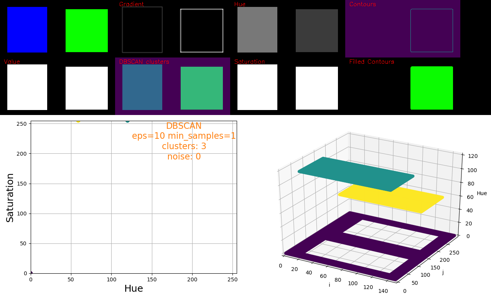
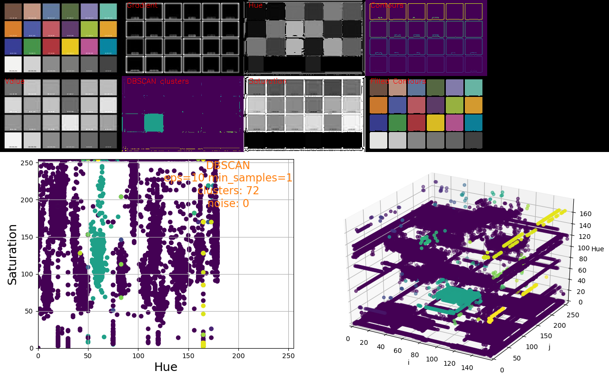
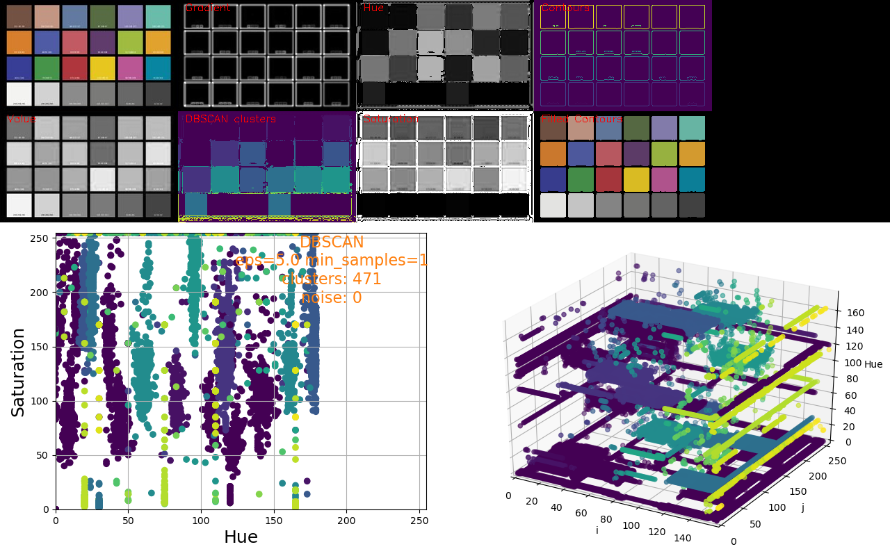
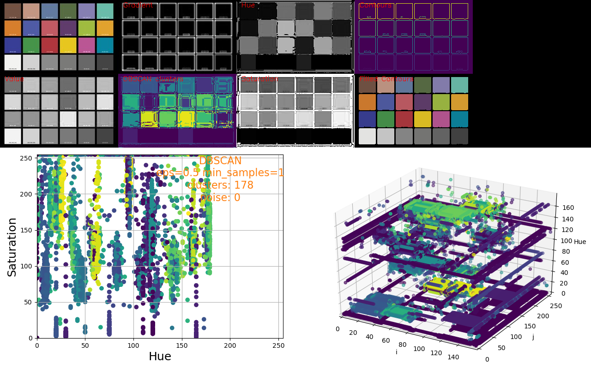
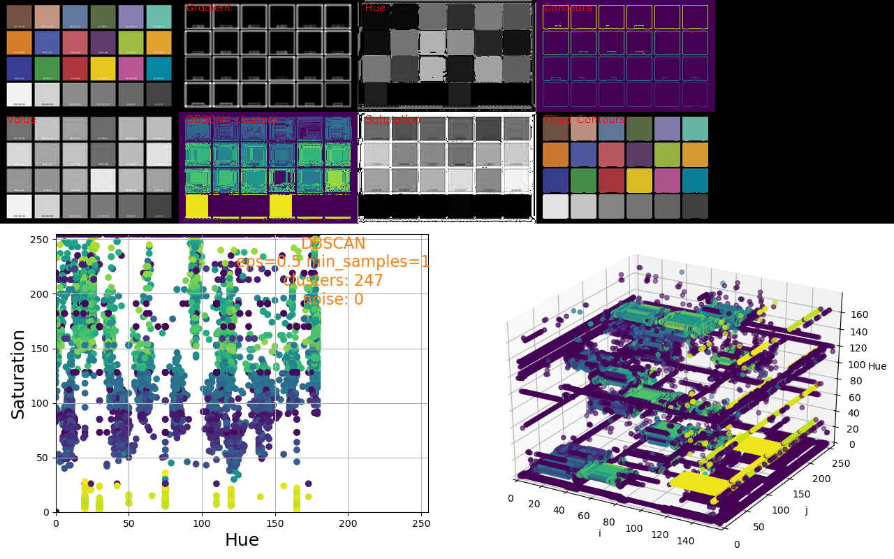
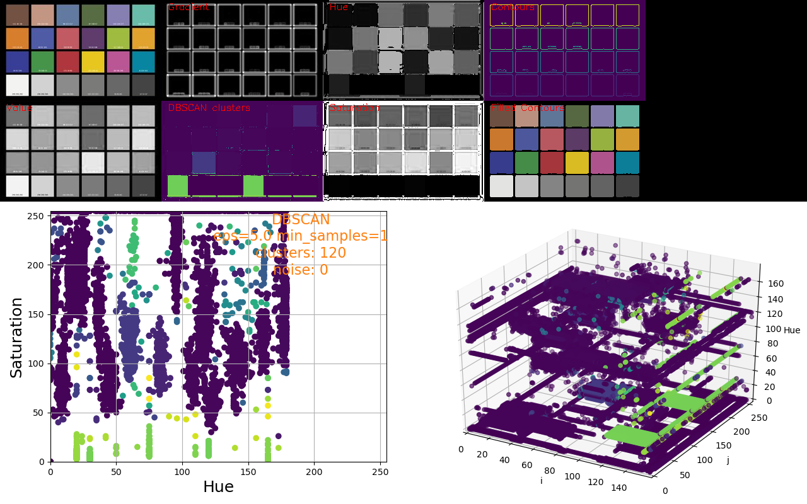

# Test: Color clustering using DBSCAN

## Context

Try to understand why color clustering with DBSCAN is not working well.

Warnings:
  - see the code for correct understand of what HSV channels are clustered wrt. what are plotted.
  - `i_j_hue_components` is clustered.

## Input data
- see: [Color_Checker](https://en.wikipedia.org/wiki/File:Color_Checker.pdf)

## Blue Green image
- `python3 color_clustering_dbscan.py -i blue_green.png --roi 8 8 300 150`
- log:
```bash
HDBSCAN is not available (> 1.3)
Input image: blue_green.png
Subsample factor: 1
DBSCAN eps: 10
DBSCAN min_samples: 1
save: blue_green_DBSCAN.png
No ROI?: False
Input ROI: [8, 8, 300, 150]
Use HSV?: False
Gaussian kernel size: 11x11
Components to cluster: 1
Colormap: 16
Use HDBSCAN?: False
Fill contours?: False
image_original=(180, 320, 3)
image_subsample=(180, 320, 3)
roi=[8, 8, 300, 150]
cropped_image=(150, 300, 3)
cnts=2
hsv=(150, 300, 3)
hue_component_flatten=(45000, 1)
sat_component_flatten=(45000, 1)
hue_sat_components=(45000, 2)
image_from_plot_bgr=(480, 640, 3) ; dtype=uint8
img_i_j_hue=(480, 640, 3) ; dtype=uint8
output=(300, 1200, 3) ; dtype=uint8
final_ouptut: 780x1280
```



## Color_Checker_320x180.jpg i-j-Hue
- `python3 color_clustering_dbscan.py -i Color_Checker_320x180.jpg --roi 38 10 256 160`
- log:
```bash
HDBSCAN is not available (> 1.3)
Input image: Color_Checker_320x180.jpg
Subsample factor: 1
DBSCAN eps: 10
DBSCAN min_samples: 1
save: Color_Checker_320x180_DBSCAN.png
No ROI?: False
Input ROI: [38, 10, 256, 160]
Use HSV?: False
Gaussian kernel size: 11x11
Components to cluster: 1
Colormap: 16
Use HDBSCAN?: False
Fill contours?: False
image_original=(180, 320, 3)
image_subsample=(180, 320, 3)
roi=[38, 10, 256, 160]
cropped_image=(160, 256, 3)
cnts=65
hsv=(160, 256, 3)
hue_component_flatten=(40960, 1)
sat_component_flatten=(40960, 1)
hue_sat_components=(40960, 2)
image_from_plot_bgr=(480, 640, 3) ; dtype=uint8
img_i_j_hue=(480, 640, 3) ; dtype=uint8
output=(320, 1024, 3) ; dtype=uint8
final_ouptut: 800x1280
```





## Color_Checker_320x180.jpg only on HUE
- `python3 color_clustering_dbscan.py -i Color_Checker_320x180.jpg --roi 38 10 256 160 -s Color_Checker_320x180_DBSCAN.png --eps 0.5`
- log:
```bash
HDBSCAN is not available (> 1.3)
Input image: Color_Checker_320x180.jpg
Subsample factor: 1
DBSCAN eps: 0.5
DBSCAN min_samples: 1
save: Color_Checker_320x180_DBSCAN.png
No ROI?: False
Input ROI: [38, 10, 256, 160]
Use HSV?: False
Gaussian kernel size: 11x11
Components to cluster: 1
Colormap: 16
Use HDBSCAN?: False
Fill contours?: False
image_original=(180, 320, 3)
image_subsample=(180, 320, 3)
roi=[38, 10, 256, 160]
cropped_image=(160, 256, 3)
HSV=(160, 256, 3) ; dtype=uint8
H median=90.0 ; H std=118.23269852425791 ; S median=52.15686274509804 ; S std=35.5243973501793 ; V median=54.509803921568626 ; V std=31.027041671832094
cnts=65
HSV=(160, 256, 3) ; dtype=uint8
H median=90.0 ; H std=118.23269852425791 ; S median=52.15686274509804 ; S std=35.5243973501793 ; V median=54.509803921568626 ; V std=31.027041671832094
hsv=(160, 256, 3)
hue_component_flatten=(40960, 1)
sat_component_flatten=(40960, 1)
hue_sat_components=(40960, 2)
image_from_plot_bgr=(480, 640, 3) ; dtype=uint8
img_i_j_hue=(480, 640, 3) ; dtype=uint8
output=(320, 1024, 3) ; dtype=uint8
final_ouptut: 800x1280
```



## Color_Checker_320x180.jpg only on SAT
- `python3 color_clustering_dbscan.py -i Color_Checker_320x180.jpg --roi 38 10 256 160 -s Color_Checker_320x180_DBSCAN.png --eps 0.5`
- log:
```bash
HDBSCAN is not available (> 1.3)
Input image: Color_Checker_320x180.jpg
Subsample factor: 1
DBSCAN eps: 0.5
DBSCAN min_samples: 1
save: Color_Checker_320x180_DBSCAN.png
No ROI?: False
Input ROI: [38, 10, 256, 160]
Use HSV?: False
Gaussian kernel size: 11x11
Components to cluster: 1
Colormap: 16
Use HDBSCAN?: False
Fill contours?: False
image_original=(180, 320, 3)
image_subsample=(180, 320, 3)
roi=[38, 10, 256, 160]
cropped_image=(160, 256, 3)
HSV=(160, 256, 3) ; dtype=uint8
H median=90.0 ; H std=118.23269852425791 ; S median=52.15686274509804 ; S std=35.5243973501793 ; V median=54.509803921568626 ; V std=31.027041671832094
cnts=65
HSV=(160, 256, 3) ; dtype=uint8
H median=90.0 ; H std=118.23269852425791 ; S median=52.15686274509804 ; S std=35.5243973501793 ; V median=54.509803921568626 ; V std=31.027041671832094
hsv=(160, 256, 3)
hue_component_flatten=(40960, 1)
sat_component_flatten=(40960, 1)
hue_sat_components=(40960, 2)
image_from_plot_bgr=(480, 640, 3) ; dtype=uint8
img_i_j_hue=(480, 640, 3) ; dtype=uint8
output=(320, 1024, 3) ; dtype=uint8
final_ouptut: 800x1280
```



## Color_Checker_320x180.jpg only on HUE-SAT
- `python3 color_clustering_dbscan.py -i Color_Checker_320x180.jpg --roi 38 10 256 160 -s Color_Checker_320x180_DBSCAN.png --eps 5`
- log:
```bash
HDBSCAN is not available (> 1.3)
Input image: Color_Checker_320x180.jpg
Subsample factor: 1
DBSCAN eps: 5.0
DBSCAN min_samples: 1
save: Color_Checker_320x180_DBSCAN.png
No ROI?: False
Input ROI: [38, 10, 256, 160]
Use HSV?: False
Gaussian kernel size: 11x11
Components to cluster: 1
Colormap: 16
Use HDBSCAN?: False
Fill contours?: False
image_original=(180, 320, 3)
image_subsample=(180, 320, 3)
roi=[38, 10, 256, 160]
cropped_image=(160, 256, 3)
HSV=(160, 256, 3) ; dtype=uint8
H median=90.0 ; H std=118.23269852425791 ; S median=52.15686274509804 ; S std=35.5243973501793 ; V median=54.509803921568626 ; V std=31.027041671832094
cnts=65
HSV=(160, 256, 3) ; dtype=uint8
H median=90.0 ; H std=118.23269852425791 ; S median=52.15686274509804 ; S std=35.5243973501793 ; V median=54.509803921568626 ; V std=31.027041671832094
hsv=(160, 256, 3)
hue_component_flatten=(40960, 1)
sat_component_flatten=(40960, 1)
hue_sat_components=(40960, 2)
image_from_plot_bgr=(480, 640, 3) ; dtype=uint8
img_i_j_hue=(480, 640, 3) ; dtype=uint8
output=(320, 1024, 3) ; dtype=uint8
final_ouptut: 800x1280
```


